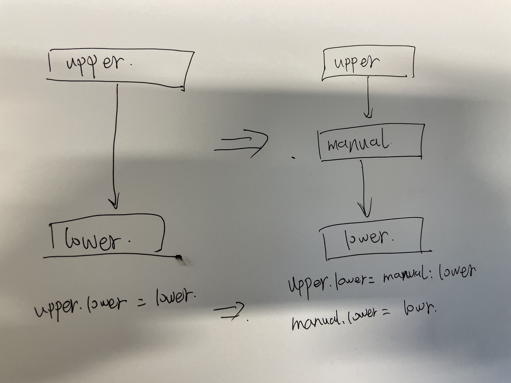

This script mainly does the following stuff:

1. Insert a new layer to the original layer
2. The new layer is mounted to a remote dir
3. Check if the container could access to the new layer

Checkout this: https://docs.docker.com/storage/storagedriver/overlayfs-driver/#how-the-overlay2-driver-works